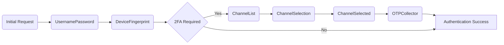

# Manulife Mobile API

## Authentication Flow
Manulife now does authentication via "Manulife ID" which then can authorize requests to several different applications.

The base URI of Manulife ID authentication requests is `https://personal.id.manulife.ca`. There are many headers included in authentication requests but I will only include the ones that seem to matter for a bare-bones implementation.

### 1. Create Authentication Token

You first need to create an authentication token that you can later exchange for a usable oauth token. This is a multistep process, with each stage being a POST to `/am/json/realms/mobile/authenticate` and the next stage depending on each response.
The POST body for each stage is the response JSON from the previous stage with any input filled in as necessary, and the `stage` key set to the next stage.

All POST bodies (aside from the initial one which is empty) are JSON.

###### Request
```
POST /am/json/realms/mobile/authenticate
```
| Key | Example | Description |
| - | - | - |
| authId | `eyJ0..uPJI` | A base64 string. This is the authId value from the previous stage. Each successful stage appends more data to this. |
| stage | `UsernamePassword` | The current stage you are submitting. The response to this request will tell you the next stage via `.callbacks[0].output[0].value.stage`. See the [Manulife ID Stages](#manulife-id-stages) section for more information. |
| callbacks | See [Manulife ID Stages](#manulife-id-stages) | All the callbacks passed to you from the previous stage with inputs filled in as required. |

###### Response
```json
{
    "authId": "eyJ0....uPJI",
    "callbacks": [...]
}
```

Kick off the authentication process with a POST to `/am/json/realms/mobile/authenticate?authIndexType=service&authIndexValue=authTree` that has an empty body. You should receive a `UsernamePassword` stage response.

#### Manulife ID Stages

`callbacks` is an array of objects of the form:
```json
{
    "_id": 0,
       "input": [
        {
            "name": "",
            "value": ""
        }
    ],
    "output": [
        {
            "name": "",
            "value": {}
        }
    ],
    "type": ""
}
```
There will always be at least two callbacks, and the first callback will always be of type `MetadataCallback`. `MetadataCallback.output[0].value.stage` holds the name of the next stage in the authentication process, and should be copied to the `stage` key for the next POST body.




| Stage | Callback Type | Description | Input Required |
| - | - | - | - |
| UsernamePassword | NameCallback | An input for the username of the Manulife ID account | `.input[0].value` should be set to the username of the Manulife ID account. This input should have a name of `IDToken2`. |
| UsernamePassword | PasswordCallback | An input for the password of the Manulife ID account | `.input[0].value` should be set to the password of the Manulife ID account. This input should have a name of `IDToken3`. |
| DeviceFingerprint | TextOutputCallback | `.output.value` will contain a JS snippit that the mobile device is expected to run. The output of the script is expected in the accompanying `HiddenValueCallback`. | No. |
| DeviceFingerprint | HiddenValueCallback | An input for the result of the script in `TextOutputCallback`. If the submitted fingerprint is not new, 2FA will not be required and the next stage should contain the token. Otherwise, you will have to go through the other stages as described in the above diagram.| `.input[0].value` should be set to  the output of the `TextOutputCallback` script, which is a JSON string of fingerprinting data. An example of this data can be found [below](#device-fingerprinting). |
| ChannelList | TextOutputCallback | `.output.value` contains another JS snippit. | No. |
| ChannelList | HiddenValueCallback | Not used. | No. |
| ChannelSelection | ChoiceCallback | `.output[1].value` contains an array of 2FA choices such as `Mobile`, `Email`, and `Secondary Email`. `.output[2].value` is the default choice index, usually `0`. | `.input[0].value` should be set to the index of the `.output[1].value` 2FA choice array you would like to use. Submitting this stage will trigger a 2FA code to be generated for the user.|
| ChannelSelected | TextOutputCallback | `.output.value` contains another JS snippit. | No. |
| ChannelSelected | HiddenValueCallback | Not used. | No. |
| OTPCollector | PasswordCallback | An input for the 2FA code. Once this stage is submitted, the next stage should contain the token. | `.input[0].value` should be set to the 2FA code received by the user. This should have a name of `IDToken2`. |

##### Device Fingerprinting
Ensure that the device fingerprint data is sent as a JSON string, not an object in the greater request JSON payload.
The script **apparently** used to generate this payload on a mobile device can be [found in the repo](device_fingerprint.js), however the output actually send back by the mobile app is different so it is likely the script is never executed at all. I have found that none of the fingerprint information needs to change between requests. Data in this example has been anonymized but has the same form as the original fingerprint.
```json
{
   "identifier": "d0ef248d29f6c596-213cf5f582921d7862cc276e82f4d6681dd62180",
   "version": "1.0",
   "platform": "Android",
   "hardware": {
       "hardware": "ranchu",
       "manufacturer": "google",
       "storage": 672,
       "memory": 2048,
       "cpu": 4,
       "display": {
           "width": 1080,
           "height": 1977,
           "orientation": 1
       },
       "camera": {
           "numberOfCameras": 2
       }
   },
   "browser": {
       "userAgent": "Mozilla/5.0 (Linux; Android 10; Android SDK built for x86_64Build/QSR1.221340.002; wv) AppleWebKit/535.25 (KHTML, like Gecko) Version/4.0 Chrome/65.0.1234.332 Mobile Safari/233.14"
   },
   "bluetooth": {
       "supported": false
   },
   "network": {
       "connected": true
   },
   "telephony": {
       "networkCountryIso": "ca",
       "carrierName": "Telus"
   },
   "appCodeName": "MobileSDK"
}
```

###### Authentication Success
Once all the stages are complete, the response will no longer contain `authId` and `callbacks`, but will look like:
```json
{
    "realm": "/customers/mobile",
    "successUrl": "/am/console",
    "tokenId": "eto...IwMQ..*"
}
```
The `tokenId` value here can now be exchanged for an OAuth token.

### 2. Exchange Authentication Token for OAuth Token

#### Generate Code and Verifier
A challenge is required to exchange the token. Manulife ID uses [RFC 7636](https://datatracker.ietf.org/doc/html/rfc7636#section-4.1), so for example in NodeJS using [CryptoJS](https://github.com/brix/crypto-js):
```js
function base64URLEncode(words) {
    return CryptoJS.enc.Base64.stringify(words)
        .replace(/\+/g, '-')
        .replace(/\//g, '_')
        .replace(/=/g, '');
}
const verifier = base64URLEncode(CryptoJS.lib.WordArray.random(50)); // KiP_kZddUxMXnvcbTgLLlOvLq-aBDM72L5SzXo9e455pMp9YGU3nSn-t2eTLDWznCJpxVZXzmDVpTUqh4KSv2g
const challenge = base64URLEncode(CryptoJS.SHA256(verifier)); // TK2Z1JRCO4_r5XMDgoi5ZsugTNgVLvGxsS3CLZvOrbA
```

#### Initiate OAuth Authorization Code Flow
```
GET /am/oauth2/realms/mobile/authorize
```
| Query Parameter | Example | Description |
| - | - | - |
| iPlanetDirectoryPro | `eto...IwMQ..*` | The `tokenId` value from [Authentication Success](#authentication-success) |
| client_id | general@mobile.customers.ciam | This is always the same |
| scope | openid ciam | This is always the same |
| response_type | code | This is always the same |
| redirect_uri | manulifemobile://oauth2redirect | I did not test if this could be different. This GET is expected to return a 302 redirect with the next token you need, so you don't want to follow the redirect anyways. |
| code_challenge | `TK2Z1J...LZvOrbA` | Your `challenge` from [Generate Code and Verifier](#generate-code-and-verifier) |
| code_challenge_method | S256 | The method of code/verifier generation. Follow the RFC here. The provided JS example uses `S256` but `plain` is also an option.

The GET should return a 302 to the `redirect_uri` with additional query parameters:
| Query Parameter | Example | Description |
| - | - | - |
| code | `Y90...jska_Mq4` | Exchange this code for an access token in the next step. |
| iss | /am/oauth2/realms/root/realms/customers/realms/mobile | |
| client_id | general@mobile.customers.ciam | |

#### Retrieve OAuth token
```
POST /am/oauth2/realms/mobile/access_token
```
The POST body here is application/x-www-form-urlencoded, not JSON like the rest.
| Key | Value | Description |
| - | - | - |
| client_id | general@mobile.customers.ciam | |
| code | `Y90...jska_Mq4` | The code from the previous redirect |
| redirect_uri | manulifemobile://oauth2redirect | |
| grant_type | authorization_code | |
| code_verifier | `KiP_k...pTUqh4KSv2g` | Your `verifier` from [Generate Code and Verifier](#generate-code-and-verifier) |

The response contains your oauth access token inside `access_token` and should be passed as `x-authorization: Bearer UX...8ze` for further [Authenticated Requests](#authenticated-requests). 
```json
{
    "access_token": "UX...8zE",
    "expires_in": 899,
    "id_token": "eyJ0eXA...-LD1V_Q",
    "scope": "openid ciam",
    "token_type": "Bearer"
}
```

For futher requests against the Manulife ID system, the `access_token` is sufficient. For example, to retrieve information about the authenticated user:
```
GET /am/oauth2/realms/mobile/userinfo
```
| Header | Value |
| - | - |
| Authorization | Bearer UX...8ze |
```json
{
    "ciamSessionRef": "Fh...Q==",
    "ciamSessionStepupStates": [],
    "ciam_id": "5e...c73",
    "dob": "2022-04-12T00:00:00Z",
    "email": "manulife@example.com",
    "family_name": "Doe",
    "given_name": "John",
    "last_password_changed": "20220412000000.000Z",
    "mobile_number": "+1 1234567890",
    "name": "jdoe",
    "sessionLocale": "",
    "sub": "5e...c73"
}
```

### 3. Fetch apigee Token
The base URI of the [apigee](https://cloud.google.com/apigee) request is `https://manulife-operations-prod-ext.apigee.net`.
POST bodies and responses are all JSON.
```
POST /v1/mg/oauth2/token
```
| Key | Value | Description |
| - | - | - |
| client_id | `kg0KA...y2yJ` | I believe this is hardcoded into the app but on the off chance it contains sensitive data I have redacted it. |
| client_secret | `C0zHP...5BR1f` | I believe this is hardcoded into the app but on the off chance it contains sensitive data I have redacted it. |
| grant_type | client_credentials | |
The response contains your access token inside `access_token` or `token` and should be passed as `authorization: Bearer eyJraW...EfjLg` for further [Authenticated Requests](#authenticated-requests). 
```json
{
    "access_token": "eyJraW...EfjLg",
    "expires_in": "3600",
    "issued_at": "1600000000",
    "token": "eyJraW...EfjLg"
}
```

## Authenticated Requests
The API base URI for retirement and benefit accounts is `cac.mesh.api.manulife.com`

All authenticated requests should contain the following headers:
| Header | Value | Description |
| - | - | - |
| `Authorization` | Bearer eyJraW...EfjLg | The apigee token. See [Fetch apigee Token](#fetch-apigee-token). |
| `x-Authorization` | Bearer UX...8zE | The OAuth token from Manulife ID authentication. See [Retrieve OAuth token](#retrieve-oauth-token). |
| `x-jailbroken-flag` | false | This can also be true but it may limit functionality with portions of the API. |
| `x-device-id` | Android SDK built for x86_64 | This is likely just for internal metrics |
| `x-vendor-id` | unknown/10 | This is likely just for internal metrics |
| `x-source-system` | grs | `mapping.source` from an account mapping. See [Account Mappings](#account-mappings) |
| `x-provider` | grs-mps-member | `mapping.provider` from an account mapping. See [Account Mappings](#account-mappings) |
| `x-identity-id` | 123456789 | `mapping.id` from an account mapping. See [Account Mappings](#account-mappings) |

Authenticated requests to an api for a linked account must have `x-source-system`, `x-provider`, and `x-identity-id` set appropriately for the account in that API.

### Account Mappings
This request is authenticated, but does not need the `x-source-system`, `x-provider`, or `x-identity-id` headers. It should return all accounts mapped to the authenticated Manulife ID.
```
POST /v1/mobile/common/ca/mappings/search?refresh=true
```
```json
{
    "mappings": [
        {
            "id": "12345:12345678",
            "label": "Group Benefits",
            "provider": "gb-plan-member",
            "source": "gb"
        },
        {
            "id": "123456789",
            "label": "Group Retirement",
            "provider": "grs-mps-member",
            "source": "grs"
        }
    ],
    "messages": []
}
```
If you wanted to make requests to a group benefits API, you would set:
| Header | Value |
| - | - |
| x-source-system | gb |
| x-provider | gb-plan-member |
| x-identity-id | 12345:12345678 |

## Group Retirement API

### Roles
```
GET /v1/mobile/group_retirement/ca/member/roles?language=en&refresh=true
```

### Personal Rate of Return
```
GET /v1/mobile/group_retirement/ca/plans/annualized-prr
```

### Asset Balances
```
GET /v1/mobile/group_retirement/ca/plans/asset-balance
```

### Recent Transactions
```
GET /v1/mobile/group_retirement/ca/plans/recent-transactions
```

### Asset Breakdown
```
GET /v1/mobile/group_retirement/ca/plans/asset-balance/:memberPlanID
```
